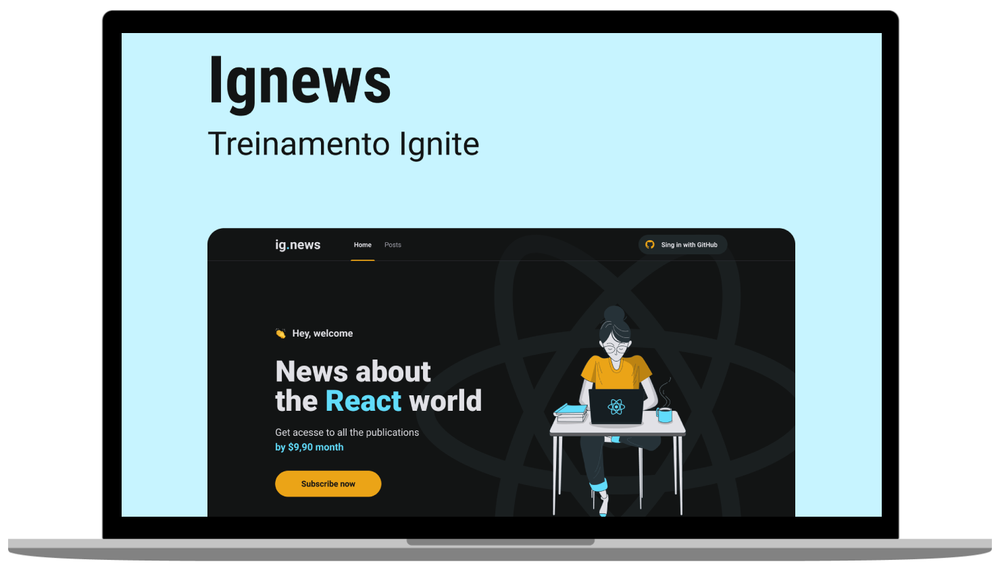

<p align="center">
  
</p>

## 💻Projeto
**Ignews** é um blog focado em assuntos de tecnologia que entrega matérias completas para seus assinantes.
<br />
<br />
<p align="center">
  
</p>
<br />

## ⚙️Como o projeto funciona?
Através do site o usuário pode fazer login com sua conta do Github e assinar a mensalidade do blog para ter acesso completo aos posts publicados no Ignews.

## 👨🏻‍💻Tecnologias usadas
Este projeto foi desenvolvido utilizando as seguintes tecnologias:
  * [Nextjs](https://nextjs.org/)
  * [React JS](https://pt-br.reactjs.org)
  * [Typescript](https://www.typescriptlang.org/)
  * [Faunadb](https://fauna.com/)
  * [Stripe](https://stripe.com/br)
  * [Primisc](https://prismic.io/)

## ▶️Como rodar
  ### **Pré-requisitos**
  - É **necessário** possuir o **[Node.js](https://nodejs.org/en/)** instalado de forma global na sua máquina.
  
 ### **Passo a passo para rodar a aplicação**  
1. Faça o clone do repositório :

```sh
  $ git clone https://github.com/dev-viniciuss/ignews.git
```

2. Executando a Aplicação:

```sh

  $ cd ignews
  $ yarn install
  $ yarn dev
```
  
## 🚀Quem proporcionou a execução desse projeto?
O projeto foi desenvolvido durante o treinamento da Rockeseat chamado **Ignite** na trilha de ReactJS,realizado pela **[Rocketseat](https://rocketseat.com.br)** com as aulas ministradas pelo **[Diego Fernandes](https://github.com/diego3g)**!

## 👨🏻‍🚀Meus agradecimentos
Fica aqui meu profundo obrigado a **[Rocketseat](https://rocketseat.com.br)**,ao **[Diego Fernandes](https://github.com/diego3g)** e a **[Comunidade da Rocketseat](https://discordapp.com/invite/gCRAFhc)**!

<h4 align="center">
    👨🏻‍🚀 Feito por <a href="https://www.linkedin.com/in/marcus-vinicius-silva-costa-6098911a4" target="_blank">Marcus Vinicius</a>
</h4>
